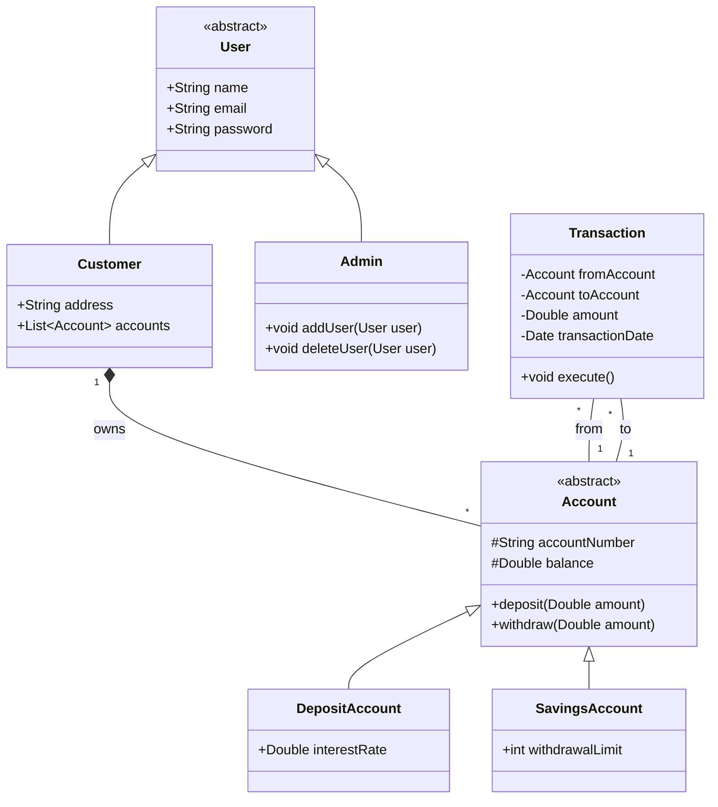

# Bank Management System

This is a simple bank management system that allows users to create accounts, deposit money, withdraw money, and check their balance. The system is implemented in Spring Boot.

## Features

## Installation

## Usage

## Class Diagram

## Technologies Used

## Contributing

If you would like to contribute to this project, please open an issue or submit a pull request.
